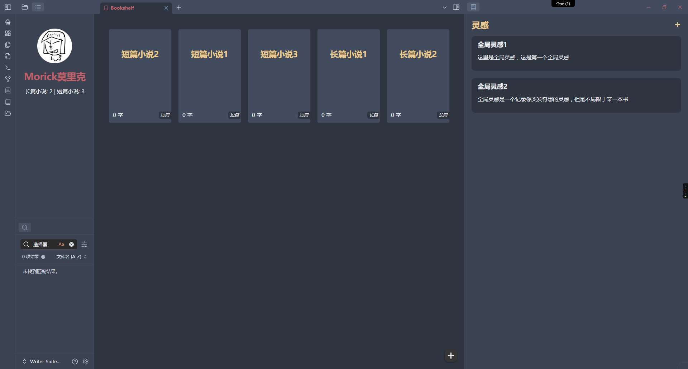
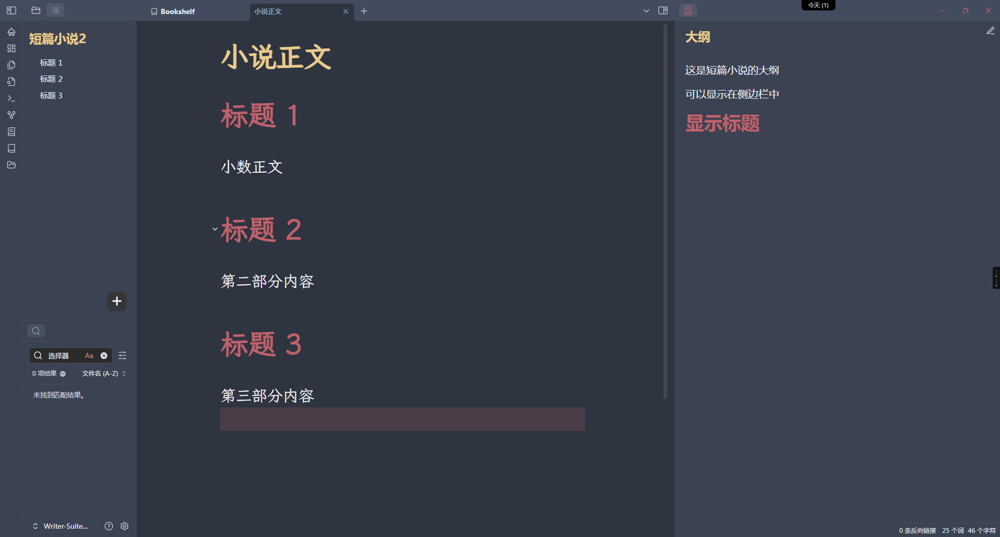
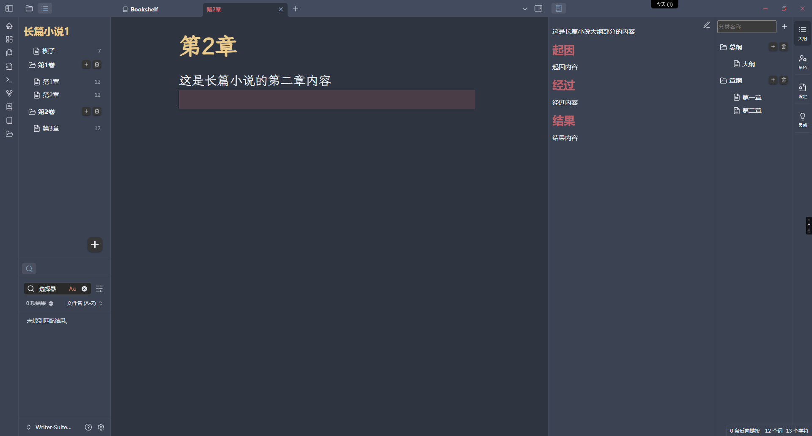

# Obsidian Writer Suite
obsidian小说创作插件

> ⚠ **警告**
> 1. 插件目前还存在一些小bug，但是基本使用并无大碍
> 2. 插件目前只有中文，后续可能会支持英文
> 3. 诸如文件夹结构暂时无法自定义，目前只能使用我设定的这种文件夹结构
> 4. 需要单独创建一个obsidian仓库使用
> 5. 所有都是基于obsidian的文件和文件夹重新渲染展示，所以当使用同步插件时，插件不同步空文件夹就会导致创建的分类消失，所以创建了分类建议在分类下创建一个文件

## 特色

1. 涵盖长篇小说和短篇小说
2. 侧边栏显示大纲，创作时方便参考
3. 更舒服的目录，不用一层层的在树状文件结构中寻找章节
4. 全局灵感
5. 长篇小说的书籍设定部分包含大纲、角色、设定、灵感四大类，可自己创建分类
6. 基于obsidian的文件结构，零迁移成本。
7. 每一章节的字数统计以及全书的字数统计。
8. 以及其他

## 文件夹结构

仓库根目录中，除一个“@附件”的文件夹之外，一篇小说（无论长篇短篇）一个文件夹。

### @附件

这个文件夹存放可能的一些附件图片之类，目前有一个`灵感`文件夹，用于存放全局灵感。

### 长篇小说
- 信息.md
  - 存储小说基本信息
- 小说文稿
  - 存放小说文稿，可以分卷
- 设定
  - 存放小说设定、大纲等
  - 目前存在大纲、设定、角色、灵感四个大分类
  - 大分类下可以自定义小分类

### 短篇小说

短篇小说文件夹下有三个文件

- 信息.md
  - 小说基本信息
- 小说正文.md
  - 短篇小说的正文
- 大纲.md
  - 小说的大纲文件

## 插件功能

### 书架视图

书架视图，可以显示你创建的所有小说，包含长篇小说和短篇小说。

#### 新建书籍

点击书架视图中右下角的“+”按钮，出现新建书籍对话框。

可以定义书籍名称，小说的类型，和简介。

### 个人信息

可以在插件设置中设置头像（暂时只支持图床链接）和昵称。

简单显示创建的短篇小说和长篇小说的数量

### 全局灵感

显示全局灵感的快捷添加和删除，点击进入文件修改。

## 插件截图

### 书架视图

### 短篇小说

### 长篇小说

## 使用

直接下载[Writer-Suite示例库](https://github.com/Morick66/obsidian-writer-suite/tree/main/ExampleVault)

或者从`Releases`下载添加到obsidian的插件文件夹中即可。